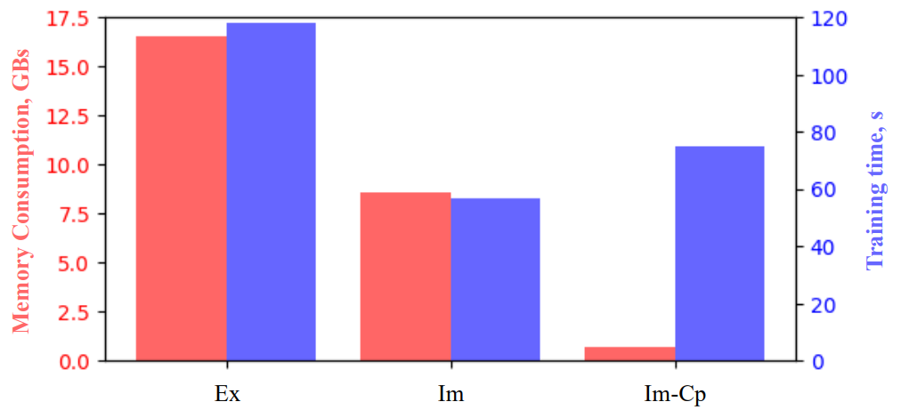

# Im-PiNDiff
## Implicit Probabilistic Physics-Integrated Neural Differentiable Modeling

This repository contains the official implementation of **Im-PiNDiff**, an implicit probabilistic physics-integrated neural differentiable modeling framework. Inspired by deep equilibrium
models, Im-PiNDiff advances the state using implicit fixed-point layers, enabling robust long-
term simulation while remaining fully end-to-end differentiable. To enable scalable training,
we introduce a hybrid gradient propagation strategy that integrates adjoint-state methods
with reverse-mode automatic differentiation. This approach eliminates the need to store
intermediate solver states and decouples memory complexity from the number of solver iter-
ations, significantly reducing training overhead. We further incorporate checkpointing tech-
niques to manage memory in long-horizon rollouts.


The associated paper can be found here:  
https://www.sciencedirect.com/science/article/pii/S0045782525005523

---

## Key Insight

A central contribution of this work is the use of an **adjoint-based training strategy** `nn > adjoint.py`, which significantly reduces memory usage and computational cost. This enables efficient training of implicit neural differential models for long-time horizons and stiff dynamics.

<p align="center">
  
</p>

Im: Implicit method with Adjoint, Cp: Checkpoint

Details of the experimental datasets, numerical settings, and evaluation protocols are provided in the paper.

---

## Data generation and training training Im-PiNDiff:
The `main.py` is used for both generating the data and traininig the model.

### Data Generation
exicute `main.py` with `gen_data = True` 

### Train on synthetic data:
exicute `main.py` with `gen_data = False` 

### Choose a problem type:
To choose the problem set 
` prob_typ = "AdvDiff" or "Burgers1v", stddynmc = "steady" or "dynamic"` in  `main.py`

---

## Problem Scope

The framework is demonstrated on representative partial differential equations, including:

- Advection–Diffusion systems  
- Burgers’ equation  

Both steady-state and time-dependent dynamical regimes are considered.

---

## Acknowledgments

The authors would like to acknowledge the funds from the Air Force Office of Scientific Research (AFOSR), United States of America under award number FA9550-22-1-0065. JXW would also like to acknowledge the funding support from the Office of Naval Research under award number N00014-23-1-2071 and the National Science Foundation under award number OAC-2047127 in supporting this study.

---

## Citation

If you find this work useful, please cite:

```bibtex
@article{akhare2025implicit,
  title={Implicit Neural Differential Model for Spatiotemporal Dynamics},
  author={Akhare, Deepak and Du, Pan and Luo, Tengfei and Wang, Jian-Xun},
  journal={arXiv preprint arXiv:2504.02260},
  year={2025}
}
